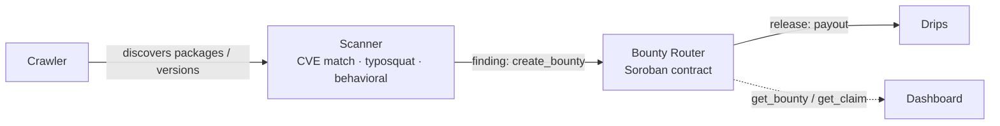

# DepRadar

**A decentralized security scanner for open-source dependency graphs — funded bounties, not empty advisories.**

## Mission

DepRadar crawls open-source package registries, scans dependency graphs for
known vulnerabilities, maintainer-account takeovers, and typosquatting, and
pays out bounties through [Drips](https://www.drips.network/) to whoever
catches the issue first — verifiably, on-chain, without a foundation or a
platform sitting between the finder and the payout.

## Architecture

- **Crawler** walks registries (npm, PyPI, crates.io, and others as modules
  land) for new packages, new versions, and metadata changes.
- **Scanner** evaluates what the crawler surfaces against three detection
  classes: known-CVE matching, typosquat similarity, and behavioral
  analysis (install scripts, obfuscation, anomalous permission requests).
- **Bounty Router** is the Soroban smart contract in this repo
  (`contracts/deprader_router/`). It's the trust boundary: it locks funds
  against a finding, records who claimed it, and pays out — independent of
  which crawler or scanner module produced the finding.
- **Drips** handles the actual payout distribution once a bounty is
  released.
- **Dashboard** is a read-only consumer of the contract's public state
  (`get_bounty` / `get_claim`) — it doesn't hold any authority.

## Live on Testnet

The router contract is deployed and has completed a full bounty lifecycle
on Stellar testnet:

**Contract ID:** [`CBFLUY6NB3JOQDEUOF2JG5TL3UD7GCQ7APUJ6EHNNSUJLUELHSGIG675`](https://stellar.expert/explorer/testnet/contract/CBFLUY6NB3JOQDEUOF2JG5TL3UD7GCQ7APUJ6EHNNSUJLUELHSGIG675)

The contract's flow is deliberately minimal — three calls, each with a
single, checkable responsibility:

1. **`create_bounty(creator, bounty_id, issue_ref, amount, token)`** — locks
   `amount` of `token` from `creator` against a bounty ID, referencing the
   underlying issue (`issue_ref`). Funds move into the contract at this
   point; nobody, including the admin, can touch them yet.
2. **`submit_claim(bounty_id, claimant, proof_ref)`** — records that
   `claimant` is claiming the bounty, with a reference to their proof
   (e.g. a PR or writeup). This step moves no funds — it's a public,
   on-chain record of who claimed what, and when.
3. **`release(admin, bounty_id)`** — admin-gated and callable exactly once
   per bounty. Pays the locked funds to whoever is on record as the
   claimant, then marks the bounty released so it cannot be paid out
   twice.

`get_bounty` and `get_claim` expose the full state at every step, so
anyone can verify a bounty's status without trusting a dashboard or API.

## Why This Matters

Software supply chain compromise isn't a hypothetical: the `event-stream`
backdoor, the `ua-parser-js` account takeover, and the `xz-utils`
long-con backdoor all reached production systems by exploiting the same
weak point — a compromised or abandoned maintainer identity slipping a
malicious change past a dependency graph nobody was actively watching.
Typosquatting attacks on npm and PyPI follow the same pattern at higher
volume and lower sophistication, betting that an install-time typo goes
unnoticed.

The common failure isn't a lack of detection tooling — it's that
detection has no funded, verifiable path to action. A researcher who spots
a malicious package today has no standard way to be compensated for the
find, and no public record proving they found it first. DepRadar is built
to close that gap: pay the bounty on-chain, the moment the claim is
verified, with the full trail auditable by anyone.

## Status & Roadmap

**Done**
- Bounty Router contract (`create_bounty` / `submit_claim` / `release`),
  unit-tested and deployed to Stellar testnet
- Full `create_bounty` → `submit_claim` → `release` cycle run and verified
  against the live testnet contract

**Open**
- Crawler modules (per-registry)
- Scanner modules (CVE matching, typosquat detection, behavioral analysis)
- Dashboard (read-only contract state viewer)
- Drips payout integration

See [CONTRIBUTING.md](CONTRIBUTING.md) for how to pick up a module, and
[open issues](https://github.com/ALLEN-AYODEJI/DepRadar/issues) for what's
currently up for grabs. [PROGRESS.md](PROGRESS.md) tracks what's actually
landed, module by module.

## License

Not yet finalized — a license will be added before this repo is public.
